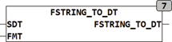

<!--
  Copyright (c) 2026 Hans Mühlbauer, Franz Höpfinger and others.

  This program and the accompanying materials are made available under the
  terms of the Eclipse Public License 2.0 which is available at
  https://www.eclipse.org/legal/epl-2.0

  SPDX-License-Identifier: EPL-2.0
-->

## Type	Funktion : DT

| | |
|:---|:---|
| **Input	[SDT](../Data Types/sdt.md)** | STRING(60) (Eingabestring) |
| **FMT** | STRING(60) (Formatierung) |
| **Output** | DT (ermitteltes Datum und Uhrzeit) |
| | FSTRING_TO_DT konvertiert eine formatierte Zeichenkette in einen DATETIME Wert. Mithilfe der Zeichenkette FMT wird eine Formatierung zur Dekodierung vorgegeben. Das Zeichen '#' gefolgt von einem Buchstaben definiert die zu Dekodierende Information. |



**Beispiel:**

```iecst
FSTRING_TO_DT('25. September 2008 um 10:01:00', '#D. #N #Y ** #h:#m:#s') FSTRING_TO_DT('13:14', '#h:#m')
```

| #Y | Jahr in der Schreibweise 08 oder 2008 |
| --- | --- |
| #M | Monat in der Schreibweise 01 oder 1 |
| #N | Monat in der Schreibweise 'JAN' oder 'Januar' (Groß und Kleinschreibung wird ignoriert) |
| #D | Tag in der Schreibweise 01 oder 1 |
| #h | Stunde in der Schreibweise 01 oder 1 |
| #m | Minute in der Schreibweise 01 oder 1 |
| #s | Sekunde in der Schreibweise 01 oder 1 |
