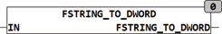

<!--
  Copyright (c) 2026 Hans Mühlbauer, Franz Höpfinger and others.

  This program and the accompanying materials are made available under the
  terms of the Eclipse Public License 2.0 which is available at
  https://www.eclipse.org/legal/epl-2.0

  SPDX-License-Identifier: EPL-2.0
-->

## Type	Funktion : DWORD

| | |
|:---|:---|
| **Input	IN** | STRING(40) (Eingabestring) |
| **Output** | DWORD (32bit Wert) |
| **FSTRING_TO_DWORD konvertiert eine formatierten Zeichenkette in einen 32bit  Wert. Es werden folgende Eingabeformate unterstützt** |  |
| | 2#0101 (binär), 8#345 (oktal), 16#2a33 (hexadezimal) und 234 (dezimal). |

