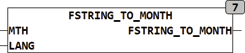

<!--
  Copyright (c) 2026 Hans Mühlbauer, Franz Höpfinger and others.

  This program and the accompanying materials are made available under the
  terms of the Eclipse Public License 2.0 which is available at
  https://www.eclipse.org/legal/epl-2.0

  SPDX-License-Identifier: EPL-2.0
-->

## Type	Funktion : INT

| | |
|:---|:---|
| **Input	MTH** | STRING(20) (Eingabestring) |
| **LANG** | INT (Sprachauswahl) |
| **Output** | INT (Monatszahl 1..12) |
| | FSTRING_TO_MONTH ermittelt aus einer Zeichenkette mit einem Monatsnamen oder Kürzel den Zahlenwert des Monats. Die Funktion kann als Eingang sowohl die Monatsnamen und Kürzel als auch eine Monatszahl verarbeiten. |
| | FSTRING_TO_MONTH('Januar',2) = 1 |
| | FSTRING_TO_MONTH('Jan',2) = 1 |
| | FSTRING_TO_MONTH('11',0) = 11 |
| | Der Eingang LANG selektiert die zu verwendende Sprache, 0 = die im Setup eingestellte Default Sprache, 1 = Englisch .... nähere Infos zu den Spracheinstellungen finden Sie im Kapitel Datentypen. |

