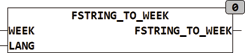

<!--
  Copyright (c) 2026 Hans Mühlbauer, Franz Höpfinger and others.

  This program and the accompanying materials are made available under the
  terms of the Eclipse Public License 2.0 which is available at
  https://www.eclipse.org/legal/epl-2.0

  SPDX-License-Identifier: EPL-2.0
-->

## Type	Funktion : BYTE

| | |
|:---|:---|
| **Input	WEEK** | STRING(60) (Eingabestring) |
| **LANG** | INT (Sprachauswahl) |
| **Output** | BYTE (Bitpattern der Wochentage) |
| | FSTRING_TO_WEEK dekodiert eine Liste von Wochentagen in der Form 'MO,DI,3' in ein Bitpattern (Bit6 = MO...Bit0 = So). Für die Auswertung werden jeweils die ersten beiden Buchstaben der Listenelemente ausgewertet, alle folgenden werden ignoriert. Falls die Zeichenkette Leerzeichen enthält werden diese entfernt. Die Wochentage können sowohl in Groß- oder Klein- Schreibung vorliegen. LANG spezifiziert die zu verwendende Sprache, 1= Englisch, 2= Deutsch, 0 ist die im Setup definierte Default Sprache. |
| | Mo = 1; Di, Tu = 2; We, Mi = 3; Th, Do = 4; Fr = 5; Sa = 6; So, Su = 7 |
| | Da die Funktion nur die ersten beiden Zeichen auswertet, können die Wochentage auch in ausgeschriebener Form (Montag) vorliegen. |
| | Als alternative Form kann der Wochentag auch als Zahl 1..7 angegeben werden. |
| | Die Liste enthält die einzelnen Wochentage unsortiert mit Komma getrennt. |
| | FSTRING_TO_WEEK('Mo,Di,Sa',2) = 2#01100010. |

