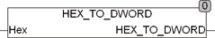

<!--
  Copyright (c) 2026 Hans Mühlbauer, Franz Höpfinger and others.

  This program and the accompanying materials are made available under the
  terms of the Eclipse Public License 2.0 which is available at
  https://www.eclipse.org/legal/epl-2.0

  SPDX-License-Identifier: EPL-2.0
-->

## Type	Funktion : DWORD

| | |
|:---|:---|
| **Input	HEX** | STRING(20) (Hexadezimale Zeichenkette) |
| **Output** | DWORD (Ausgangswert) |
| | Die Funktion HEX_TO_DWORD konvertiert eine hexadezimale Zeichenkette in einen DWORD Wert. Es werden dabei nur die hexadizimalen Zeichen sind '0'..'9', 'a..f' und 'A' .. 'F' interpretiert, alle anderen in HEX vorkommenden Zeichen werden ignoriert. |



**Beispiel:**

```iecst
HEX_TO_DWORD('FF') ergibt 255.
```
