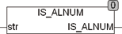

<!--
  Copyright (c) 2026 Hans Mühlbauer, Franz Höpfinger and others.

  This program and the accompanying materials are made available under the
  terms of the Eclipse Public License 2.0 which is available at
  https://www.eclipse.org/legal/epl-2.0

  SPDX-License-Identifier: EPL-2.0
-->

## IS_ALNUM

| | |
|:---|:---|
| **Type	Funktion** | BOOL |
| **Input	STR** | STRING (Eingabestring) |
| **Output** | BOOL (TRUE wenn STR nur Buchstaben oder Zahlen enthält) |
| | IS_ALNUM testet ob in der Zeichenkette STR nur Buchstaben oder Zahlen enthalten sind. Wird ein falsches, nicht alphanumerisches Zeichen gefunden gibt die Funktion FALSE zurück. Enthält STR nur Buchstaben oder Zahlen ist das Ergebnis TRUE. Buchstaben sind die Zeichen A..Z und a..z, und Zahlen sind die Zeichen 0..9. Bei der Prüfung wird die Globale Setup Konstante EXTENDED_ASCII berücksichtigt. Wenn EXTENDED_ASCII = TRUE ist werden Zeichen des erweiterten ASCII Zeichensatzes nach ISO 8859-1 berücksichtigt. Umlaute wie Ä,Ö,Ü werden nur dann berücksichtigt wenn die Globale Konstante  EXTENDED_ASCII = TRUE ist. |

