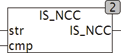

<!--
  Copyright (c) 2026 Hans Mühlbauer, Franz Höpfinger and others.

  This program and the accompanying materials are made available under the
  terms of the Eclipse Public License 2.0 which is available at
  https://www.eclipse.org/legal/epl-2.0

  SPDX-License-Identifier: EPL-2.0
-->

## IS_NCC

| | |
|:---|:---|
| **Type	Funktion** | BOOL |
| **Input	STR** | STRING (Eingabestring) |
| **CMP** | STRING (Vergleichszeichen) |
| **Output** | BOOL (TRUE wenn STR keine der im STRING CMP aufgelisteten |
| | Zeichen enthält) |
| | IS_NCC testet ob in der Zeichenkette STR keine der in STR aufgelisteten Zeichen enthalten sind. Wird ein Zeichen aus CMP in STR gefunden gibt die Funktion FALSE zurück. |
| **Beipiele** |  |
| | IS_NCC('3.14', ',-+()') = TRUE |
| | IS_NCC('-3.14', ',-+()') = FALSE |

