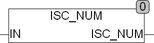

<!--
  Copyright (c) 2026 Hans Mühlbauer, Franz Höpfinger and others.

  This program and the accompanying materials are made available under the
  terms of the Eclipse Public License 2.0 which is available at
  https://www.eclipse.org/legal/epl-2.0

  SPDX-License-Identifier: EPL-2.0
-->

## IS_NUM

| | |
|:---|:---|
| **Type	Funktion** | BOOL |
| **Input	IN** | STRING (Eingabestring) |
| **Output** | BOOL (TRUE wenn STR keine Großbuchstaben enthält) |
| | IS_NUM testet ob in der Zeichenkette IN nur Zahlen enthalten sind. Wird ein anderes Zeichen gefunden gibt die Funktion FALSE zurück. Sind in IN nur Zahlen enthalten gibt die Funktion TRUE zurück. Zahlen sind die Zeichen 0..9. |

