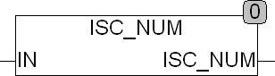

<!--
  Copyright (c) 2026 Hans Mühlbauer, Franz Höpfinger and others.

  This program and the accompanying materials are made available under the
  terms of the Eclipse Public License 2.0 which is available at
  https://www.eclipse.org/legal/epl-2.0

  SPDX-License-Identifier: EPL-2.0
-->

## Type	Funktion : BOOL

| | |
|:---|:---|
| **Input	IN** | BYTE (Zeichen) |
| **Output** | BOOL (TRUE IN ein Zeichen 0..9 ist) |
| | ISC_NUM testet ob ein Zeichen IN ein Numerisches Zeichen ist, Ist IN ein Zeichen 0..9 gibt die Funktion TRUE zurück, wenn nicht gibt die Funktion FALSE zurück. Die Zeichen von 0..9 haben die Zeichencodes (48..57). |

