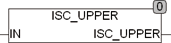

<!--
  Copyright (c) 2026 Hans Mühlbauer, Franz Höpfinger and others.

  This program and the accompanying materials are made available under the
  terms of the Eclipse Public License 2.0 which is available at
  https://www.eclipse.org/legal/epl-2.0

  SPDX-License-Identifier: EPL-2.0
-->

## ISC_UPPER

| | |
|:---|:---|
| **Type	Funktion** | BOOL |
| **Input	IN** | BYTE (Zeichen) |
| **Output** | BOOL (TRUE IN ein Zeichen 0..9 ist) |
| | ISC_UPPER testet ob ein Zeichen IN ein Großbuchstabe ist, Ist IN ein Großbuchstabe gibt die Funktion TRUE zurück, wenn nicht gibt die Funktion FALSE zurück. Bei der Prüfung wird die Globale Setup Konstante EXTENDED_ASCII berücksichtigt. Wenn EXTENDED_ASCII = TRUE ist werden Zeichen des erweiterten ASCII Zeichensatzes nach ISO 8859-1 ausgewertet. |
| **Die folgende Tabelle Erläutert die Zeichencodes** |  |

| Code | EXTENDED_ASCII=TRUE | EXTENDED_ASCII = FASLE |
| --- | --- | --- |
| 0..64,91..191,215, 223..255 | FALSE | FALSE |
| 65..90 | TRUE | TRUE |
| 192..214 | TRUE | FALSE |
| 216..222 | TRUE | FALSE |
