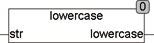

<!--
  Copyright (c) 2026 Hans Mühlbauer, Franz Höpfinger and others.

  This program and the accompanying materials are made available under the
  terms of the Eclipse Public License 2.0 which is available at
  https://www.eclipse.org/legal/epl-2.0

  SPDX-License-Identifier: EPL-2.0
-->

## LOWERCASE

| | |
|:---|:---|
| **Type	Funktion** | STRING |
| **Input	STR** | STRING (Eingabestring) |
| **Output** | STRING (STRING in Kleinbuchstaben) |
| | Die Funktion LOWERCASE wandelt den String STR in Kleinbuchstaben um. Bei der Konvertierung wird die Globale Setup Konstante EXTENDED_ASCII berücksichtigt. Wenn EXTENDED_ASCII = TRUE werden Zeichen des erweiterten ASCII Zeichensatzes nach ISO 8859-1 ausgewertet. Umlaute wie Ä,Ö,Ü werden nur dann berücksichtigt wenn die Globale Konstante  EXTENDED_ASCII = TRUE ist. Eine Detaillierte Beschreibung der Codewandlung ist bei der Funktion TO_LOWER zu finden. |

