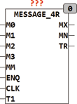

<!--
  Copyright (c) 2026 Hans Mühlbauer, Franz Höpfinger and others.

  This program and the accompanying materials are made available under the
  terms of the Eclipse Public License 2.0 which is available at
  https://www.eclipse.org/legal/epl-2.0

  SPDX-License-Identifier: EPL-2.0
-->

## Type	Funktionsbaustein

| | |
|:---|:---|
| **Input	M0** | . M3 STRING(STRING_LENGTH) (Meldungen) |
| **MM** | INT (Meldung die maximal angezeigt wird) |
| **ENQ** | BOOL (Freigabe Eingang) |
| **CLK** | BOOL (Eingang zum weiter Schalten) |
| **T1** | TIME (Zeit für automatisches Weiterschalten) |
| **Output	MX** | STRING(STRING_LENGTH) (Ausgabestring) |
| **MN** | INT (derzeit aktive Meldung) |
| **TR** | BOOL (Trigger Ausgang) |
| | MESSAGE_4R stellt am Ausgang MX eine von bis zu 4 Meldungen bereit. Es wird immer nur eine von bis zu 4 Meldungen auf MX bereitgestellt. Die Anzahl der Meldungen kann mit dem Eingang MM begrenzt werden. Wird MM auf 2 gesetzt so werden nur die Meldungen M0 .. M2 hintereinander ausgegeben. Wird MM nicht gesetzt so werden alle Meldungen M0..M3 ausgegeben. Mit jeder steigenden Flanke von CLK wird die nächste Meldung auf MX ausgegeben, bleibt CLK dauerhaft auf TRUE so wird nach Ablauf der Zeit T1 automatisch die nächste Meldung ausgegeben, solange bis CLK wieder FALSE wird. Wird der Freigabeeingang ENQ auf FALSE gesetzt, wird am Ausgang MX '' ausgegeben und der Baustein hat keinerlei Funktion. Der Ausgang MN zeigt an welche Meldung gerade am Ausgang MX ausgegeben wird. Der Ausgang TR wird immer dann für genau einen Zyklus TRUE wenn sich die Meldung am Ausgang MX verändert hat, er dient vor allem Dazu Bausteine zur Weiterverarbeitung der Meldungen anzusteuern. |

