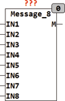

<!--
  Copyright (c) 2026 Hans Mühlbauer, Franz Höpfinger and others.

  This program and the accompanying materials are made available under the
  terms of the Eclipse Public License 2.0 which is available at
  https://www.eclipse.org/legal/epl-2.0

  SPDX-License-Identifier: EPL-2.0
-->

## MESSAGE_8

| | |
|:---|:---|
| **Type** | Funktionsbaustein |
| **Input	IN1..IN8** | BOOL (Auswahleingänge) |
| **Output	M** | STRING (Ausgangsstring) |
| | MESSAGE_8 erzeugt eine von 8 Nachrichten am Ausgang M. wenn keiner der Eingänge IN1..IN8 auf TRUE ist wird an M ein Leere Zeichenkette ausgegeben, ansonsten einer der in S1..S8 gespeicherten Nachrichten. Der Baustein gibt immer die Nachricht mit der höchsten Priorität aus. IN1 hat dabei die höchste Priorität und IN8 die niedrigste. MESSAGE_8 kann zusammen mit dem Baustein STORE_8 benutzt werden um Fehlerereignisse zu speichern und Anzuzeigen. |
| | Im folgenden Beispiel werden bis zu 8 Fehlerereignisse (E0..E7) |
| | gespeichert und jeweils die am höchsten priorisierte am Ausgang M von MESSAGE_8 angezeigt. Mit dem Eingang CLEAR kann man durch Tasten jeweils die letzte Meldung löschen und zur nächsten anstehenden Fehlermeldung Weiterschalten. MIT dem Eingang RESET kann man alle anstehenden Fehlermeldungen löschen. |
| **Setup	S1..S8** | STRING (Nachrichtenvorgabe) |

