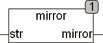

<!--
  Copyright (c) 2026 Hans Mühlbauer, Franz Höpfinger and others.

  This program and the accompanying materials are made available under the
  terms of the Eclipse Public License 2.0 which is available at
  https://www.eclipse.org/legal/epl-2.0

  SPDX-License-Identifier: EPL-2.0
-->

## Type	Funktion : STRING

| | |
|:---|:---|
| **Input	STR** | STRING (Eingangsstring) |
| **Output** | STRING (Eingangsstring Rückwärts gelesen) |
| | MIRROR liest die Zeichenkette an STR Rückwärts und gibt die Zeichen in umgekehrter Reihenfolge wieder aus. |



**Beispiel:**

```iecst
MIRROR('Das ist ein Test') = 'tseT nie tsi saD'
```
