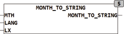

<!--
  Copyright (c) 2026 Hans Mühlbauer, Franz Höpfinger and others.

  This program and the accompanying materials are made available under the
  terms of the Eclipse Public License 2.0 which is available at
  https://www.eclipse.org/legal/epl-2.0

  SPDX-License-Identifier: EPL-2.0
-->

## MONTH_TO_STRING

| | |
|:---|:---|
| **Type	Funktion** | STRING(10) |
| **Input	MTH** | INT (Monat 1..12) |
| **LANG** | INT (Sprachauswahl 0 = Default) |
| **LX** | INT (Länge der Zeichenkette) |
| **Output** | STRING(10) (Ausgangswert) |
| **MONTH_TO_STRING wandelt eine Monatszahl in die entsprechende Zeichenkette. Der Eingang MTH gibt den entsprechenden Monat an** | 1 = Januar und 12 = Dezember. Der Eingang LANG wählt die gewünschte Sprache aus: 1 = Englisch und 2 = Deutsch. LANG = 0 benutzt die als Default Sprache in der Globalen Setup Variable LANGUAGE_DEFAULT festgelegte Sprache. Der Eingang LX legt die Länge der zu erzeugenden Zeichenkette fest: 0 = Voller Monatsname, 3 = Abkürzung mit 3 Buchstaben, alle anderen Werte am Eingang LX sind nicht definiert. |
| | Die vom Baustein erzeugten Zeichenketten sowie die unterstützten Sprachen sind im Bereich Global Constants definiert und können dort erweitert und verändert werden. |
| | MONTH_TO_STRING(1,0,0) = 'January' |
| | abhängig von der Globalen Konstante LANGUAGE_DEFAULT |
| | MONTH_TO_STRING(1,2,0) = 'Januar' |
| | MONTH_TO_STRING(1,2,3) = 'Jan' |

