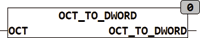

<!--
  Copyright (c) 2026 Hans Mühlbauer, Franz Höpfinger and others.

  This program and the accompanying materials are made available under the
  terms of the Eclipse Public License 2.0 which is available at
  https://www.eclipse.org/legal/epl-2.0

  SPDX-License-Identifier: EPL-2.0
-->

## OCT_TO_DWORD

| | |
|:---|:---|
| **Type	Funktion** | DWORD |
| **Input	OCT** | STRING(20) (Oktale Zeichenkette) |
| **Output** | DWORD (Ausgangswert) |
| | Die Funktion OCT_TO_DWORD konvertiert eine oktal kodierte Zeichenkette in einen BYTE Wert. Es werden dabei nur die oktalen Zeichen sind '0'..'7' interpretiert, alle anderen in HEX vorkommenden Zeichen werden ignoriert. |



**Beispiel:**

```iecst
OCT_TO_DWORD('11') ergibt 9.
```
