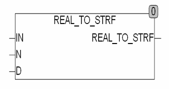

<!--
  Copyright (c) 2026 Hans Mühlbauer, Franz Höpfinger and others.

  This program and the accompanying materials are made available under the
  terms of the Eclipse Public License 2.0 which is available at
  https://www.eclipse.org/legal/epl-2.0

  SPDX-License-Identifier: EPL-2.0
-->

## REAL_TO_STRF

| | |
|:---|:---|
| **Type	Funktion** | STRING(20) |
| **Input	IN** | REAL (Eingangswert) |
| **N** | INT (Anzahl der Nachkommastellen) |
| **D** | STRING(1) (Dezimalpunktzeichen) |
| **Output** | STRING (Ausgangsstring) |
| | REAL_TO_STRF konvertiert einen REAL-Wert in einen STRING mit einer festen Anzahl von Nachkommastellen N. Bei der Konvertierung wird ausschließlich in Normales Zahlenformat XXXdNNN umgewandelt. Bei der Umwandlung wird IN auf N Stellen nach dem Komma gerundet und dann in einen String mit dem Format XXXdNNN gewandelt. Wenn N = 0 wird die REAL Zahl auf 0 Stellen hinter dem Komma gerundet und das Ergebnis als Integer ohne Punkt und Nachkommastellen ausgegeben. Wenn die Zahl IN kleiner ist als mit N Nachkommastellen erfasst werden können wird eine Null ausgegeben. Die Nachkommastellen werden immer auf N Stellen mit Nullen aufgefüllt. Die maximale Länge der Zeichenkette beträgt 20 Stellen. Der Eingang D legt fest mit welchem Zeichen der Dezimalpunkt dargestellt wird. |



**Beispiel:**

```iecst
REAL_TO_STRF(3.14159,4,'.') = '3.1416' REAL_TO_STRF(3.14159,0,'.') = '3' REAL_TO_STRF(0.04159,3,'.') = '0.042' REAL_TO_STRF(0.001,2',') = '0,00'
```
