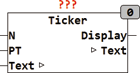

<!--
  Copyright (c) 2026 Hans Mühlbauer, Franz Höpfinger and others.

  This program and the accompanying materials are made available under the
  terms of the Eclipse Public License 2.0 which is available at
  https://www.eclipse.org/legal/epl-2.0

  SPDX-License-Identifier: EPL-2.0
-->

## Type	Funktionsbaustein

| | |
|:---|:---|
| **Input	N** | INT (Länge des Display Strings) |
| **PT** | TIME (Schiebedelay, Default = T#1s) |
| **I/O	TEXT** | STRING (Eingangsstring) |
| **Output	DISPLAY** | STRING (Ausgangsstring) |
| | TICKER erzeugt am Ausgang DISPLAY eine Laufschrift. Am Ausgang DISPLAY wird ein Teilstring von TEXT mit der Länge N ausgegeben. Display wird in einem Zeitraster von PT ausgegeben und beginnt bei jeder Ausgabe eine Stelle weiter von Links des Eingangsstrings TEXT. Die Laufschrift wird nur dann erzeugt wenn N < als die Länge von TEXT ist. Wird N >= Länge von TEXT dann wird der String TEXT direkt am Ausgang DISPLAY dargestellt. |

