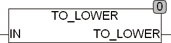

<!--
  Copyright (c) 2026 Hans Mühlbauer, Franz Höpfinger and others.

  This program and the accompanying materials are made available under the
  terms of the Eclipse Public License 2.0 which is available at
  https://www.eclipse.org/legal/epl-2.0

  SPDX-License-Identifier: EPL-2.0
-->

## Type	Funktion : BYTE

| | |
|:---|:---|
| **Input	IN** | BYTE (Zeichen das konvertiert werden soll) |
| **Output** | BYTE (konvertiertes Zeichen) |
| | TO_LOWER wandelt einzelne Zeichen in Kleinbuchstaben um. Bei der Konvertierung wird die Globale Setup Konstante EXTENDED_ASCII berücksichtigt. Wenn EXTENDED_ASCII = TRUE werden Zeichen des erweiterten ASCII Zeichensatzes nach ISO 8859-1 berücksichtigt. |
| **Die folgende Tabelle Erläutert die Codewandlung** |  |

| Code | EXTENDED_ASCII = TRUE | EXTENDED_ASCII = FALSE |
| --- | --- | --- |
| 0..64 | 0..64 | 0..64 |
| 65..90 | 97..122 | 97..122 |
| 91..191 | 91..191 | 91..191 |
| 192..214 | 224..246 | 192..214 |
| 215 | 215 | 215 |
| 216..222 | 248..254 | 216..254 |
| 223..255 | 223..255 | 223..255 |
