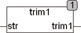

<!--
  Copyright (c) 2026 Hans Mühlbauer, Franz Höpfinger and others.

  This program and the accompanying materials are made available under the
  terms of the Eclipse Public License 2.0 which is available at
  https://www.eclipse.org/legal/epl-2.0

  SPDX-License-Identifier: EPL-2.0
-->

## Type	Funktion : STRING

| | |
|:---|:---|
| **Input	STR** | STRING (Eingabestring) |
| **Output** | STRING (STR ohne doppelte Leerzeichen) |
| | Die Funktion TRIM1 ersetzt mehrfache Leerzeichen mit nur einem Leerzeichen. Leerzeichen am Anfang und Am Ende von STR werden dabei komplett gelöscht. |



**Beispiel:**

```iecst
TRIM1(' find  BX12 ') = 'find BX12'
```
