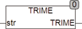

<!--
  Copyright (c) 2026 Hans Mühlbauer, Franz Höpfinger and others.

  This program and the accompanying materials are made available under the
  terms of the Eclipse Public License 2.0 which is available at
  https://www.eclipse.org/legal/epl-2.0

  SPDX-License-Identifier: EPL-2.0
-->

## Type	Funktion : STRING

| | |
|:---|:---|
| **Input	STR** | STRING (Eingabestring) |
| **Output** | STRING (Ausgabestring) |
| | Die Funktion TRIME entfernt Leerzeichen am Anfang und Am Ende von STR. Leerzeichen innerhalb des Strings werden ignoriert, auch wenn Sie mehrfach vorkommen. |

