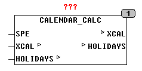

<!--
  Copyright (c) 2026 Hans Mühlbauer, Franz Höpfinger and others.

  This program and the accompanying materials are made available under the
  terms of the Eclipse Public License 2.0 which is available at
  https://www.eclipse.org/legal/epl-2.0

  SPDX-License-Identifier: EPL-2.0
-->

## CALENDAR_CALC

| | |
|:---|:---|
| **Type** | Funktionsbaustein |
| **Input	SPE** | BOOL (TRUE wird die aktuelle Sonnenposition berechnet) |
| **I/O	XCAL** | [CALENDAR](../Data Types/calendar.md) (externe Variable) |
| **HOLIDAYS** | [HOLIDAY_DATA](../Data Types/holiday_data.md) (Feiertagsliste) |
| | CALENDAR_CALC berechnet vollautomatisch alle Werte in einer Struktur vom Typ [CALENDAR](../Data Types/calendar.md) ausgehend vom Wert UTC in der Struktur. XCAL ist ein Pointer auf eine externe oder globale Variable vom Typ [CALENDAR](../Data Types/calendar.md). CALENDAR_CALC kann so über die Struktur XCAL im gesamten Programm Kalenderwerte zur Verfügung stellen. CALENDAR_CALC ermittelt bei jeder Veränderung des Wertes UTC in XCAL automatisch alle anderen Werte in der Struktur. Alleine der Wert UTC in der Struktur muss von einem RTC Baustein gespeist werden. Die Definition des strukturierten Datentyps [CALENDAR](../Data Types/calendar.md) finden Sie im Kapitel Datenstrukturen. Die fortlaufende Berechnung der Sonnenposition kann eine SPS ohne FPU stark belasten, deshalb wird der laufende Sonnenstand nur alle 25 Sekunde berechnet wenn SPE = TRUE ist. Dies entspricht einer Genauigkeit von 0,1 Grad was für Normale Anwendungen völlig Ausreichend ist. Bleibt SPE = FALSE wird die Sonnenposition nicht berechnet. Durch ein externes Array HOLIDAYS vom Typ [HOLIDAY_DATA](../Data Types/holiday_data.md) kann der Anwender gezielt Feiertage nach seinen Bedürfnissen spezifizieren, nähere Hinweise für die Definition von Feiertagen finden sie im Kapitel Datenstrukturen. |
| | Falls Mehrere Strukturen vom Typ [CALENDAR](../Data Types/calendar.md) benötigt werden (zum Beispiel für UTC und oder verschiedene Lokalzeiten) dann können entsprechend mehrere Bausteine CALENDAR_CALC mit verschiedenen Strukturen vom TYP [CALENDAR](../Data Types/calendar.md) eingesetzt werden. |
| | Das folgende Beispiel zeigt wie der Baustein SYSRTCGETTIME die RTC der CPU ausliest und die aktuelle Zeit in SYSTEMCAL.UTC schreibt. CALENDAR_CALC prüft bei jedem Zyklus ob sich der Wert in .UTC verändert hat und wenn ja ermittelt es die anderen Werte der Struktur automatisch. Der Ausgang WDAY zeigt wie man aus der Struktur Daten zur Weiterverarbeitung ausliest. CALENDAR_CALC berücksichtigt die Setup Daten aus der Datenstruktur (OFFSET, DST_EN, LONGITUDE, LATITUDE). |
| | Im externen Array HOLIDAYS können bis zu 30 Feiertage definiert werden. Beispiele hierfür finden Sie bei der Beschreibung des Datentyps [HOLIDAY_DATA](../Data Types/holiday_data.md). Dieses ARRAY of [HOLIDAY_DATA](../Data Types/holiday_data.md) muss außerhalb des Bausteins definiert werden und als Variable mit den Feiertagsdaten vorbelegt werden. |

