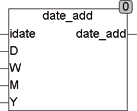

<!--
  Copyright (c) 2026 Hans Mühlbauer, Franz Höpfinger and others.

  This program and the accompanying materials are made available under the
  terms of the Eclipse Public License 2.0 which is available at
  https://www.eclipse.org/legal/epl-2.0

  SPDX-License-Identifier: EPL-2.0
-->

## Type	Funktion

| | |
|:---|:---|
| **Input	IDATE** | DATE (Eingangsdatum) |
| **D** | INT (zu addierende Tage) |
| **W** | INT (zu addierende Wochen) |
| **M** | INT (zu addierende Monate) |
| **Y** | INT (zu addierende Jahre) |
| **Output** | DATE (Ergebnisdatum) |
| | Die Funktion DATE_ADD addiert Tage, Wochen, Monate, und Jahre zu einem Datum hinzu. Es werden erst die angegebenen Tage und Wochen addiert, dann die Monate und zuletzt die Jahre. |
| | Die Eingangswerte können sowohl positiv, wie auch negativ sein. Es kann also auch von einem Datum subtrahiert werden. |
| | Vor allem bei negativen Eingangswerten ist zu beachten das das Datum beim addieren von negativen Werten wie zum Beispiel -3000 Tage nicht unter den 1.1.1970 läuft, dies würde einen Überlauf des Datentyps DATE zur folge haben und undefinierte Werte ergeben. |



**Beispiel:**

```iecst
DATE_ADD(1.1.2007,3,1,-1,-2) = 11.12.2005
```

addiert 3 Tage und 1 Woche hinzu und zieht dann 1 Monat und 2 Jahre ab.
