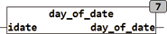

<!--
  Copyright (c) 2026 Hans Mühlbauer, Franz Höpfinger and others.

  This program and the accompanying materials are made available under the
  terms of the Eclipse Public License 2.0 which is available at
  https://www.eclipse.org/legal/epl-2.0

  SPDX-License-Identifier: EPL-2.0
-->

## Type	Funktion : DINT

| | |
|:---|:---|
| **Input	IDATE** | DATE (Eingangsdatum) |
| **Output** | DINT (Tag im Monat des Eingangsdatums) |
| | Die Funktion DAY_OF_DATE berechnet den Tag seit dem 1.1.1970. Das Ergebnis der Funktion ist vom Typ DINT weil der gesamte DATE Range 49710 Tage umfasst. |

