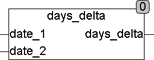

<!--
  Copyright (c) 2026 Hans Mühlbauer, Franz Höpfinger and others.

  This program and the accompanying materials are made available under the
  terms of the Eclipse Public License 2.0 which is available at
  https://www.eclipse.org/legal/epl-2.0

  SPDX-License-Identifier: EPL-2.0
-->

## Type	Funktion : DINT

| | |
|:---|:---|
| **Input	DATE_1** | DATE (Datum1) |
| **DATE_2** | DATE (Datum2) |
| **Output** | DINT (Differenz der beiden Eingangsdatums in Tagen) |
| | Die Funktion DAYS_DELTA berechnet die Differenz zweier Daten in Tagen. |



**Beispiel:**

```iecst
DAYS_DELTA(10.1.2007, 1.1.2007) = -9 DAYS_DELTA(1.1.2007, 10.1.2007) = 9
```

Das Ergebnis der Funktion ist vom Typ DINT weil der gesamte DATE Range 49710 Tage umfasst.
