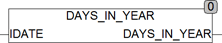

<!--
  Copyright (c) 2026 Hans Mühlbauer, Franz Höpfinger and others.

  This program and the accompanying materials are made available under the
  terms of the Eclipse Public License 2.0 which is available at
  https://www.eclipse.org/legal/epl-2.0

  SPDX-License-Identifier: EPL-2.0
-->

## Type	Funktion : INT

| | |
|:---|:---|
| **Input	IDATE** | DATE (aktuelles Datum) |
| **Output** | INT (Anzahl der Tage des aktuellen Jahres) |
| | Die Funktion DAYS_IN_YEAR berechnet die Anzahl der Tage des aktuellen Jahres. |

