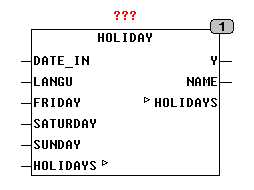

<!--
  Copyright (c) 2026 Hans Mühlbauer, Franz Höpfinger and others.

  This program and the accompanying materials are made available under the
  terms of the Eclipse Public License 2.0 which is available at
  https://www.eclipse.org/legal/epl-2.0

  SPDX-License-Identifier: EPL-2.0
-->

## HOLIDAY

| | |
|:---|:---|
| **Type** | Funktionsbaustein |
| **Input	DATE_IN** | DATE (Eingangsdatum) |
| **LANGU** | INT (gewünschte Sprache) |
| **FRIDAY** | BOOL (Y wird TRUE an Freitagen wenn TRUE) |
| **SATURDAY** | BOOL (Y wird TRUE an Samstagen wenn TRUE) |
| **SUNDAY** | BOOL (Y wird TRUE an Sonntagen wenn TRUE) |
| **I/O	HOLIDAYS** | ARRAY[0..29] of [HOLIDAY_DATA](../Data Types/holiday_data.md) |
| **Output	Y** | BOOL (TRUE, wenn DATE_IN ein Feiertag ist) |
| **Name** | STRING(30) (Name des heutigen Feiertags) |
| | Der Baustein HOLIDAY zeigt am Ausgang Y mit TRUE Feiertage an und liefert auch den Namen des aktuellen Feiertags am Ausgang NAME. HOLIDAY kann zusätzlich zu Feiergagen auch an den Wochentagen Freitag, Samstag oder Sonntag aktiv werden und am Ausgang Y TRUE liefern, abhängig davon ob die Eingänge FRIDAY, SATURDAY oder SUNDAY auf TRUE gesetzt sind. Im Array HOLIDAYS werden Name und Datum von Feiertagen definiert und sind auch dort für andere Länder universell anpassbar. Feiertage können als festes Datum, mit einem Abstand von Ostern oder Wochentag vor einem festen Datum definiert werden. Der Eingang LANGU wählt die entsprechende Sprache aus den Setup Daten aus damit die Ausgaben für Freitag, Samstag und Sonntag sprachspezifisch angepasst werden können. Die Sprachen sind unter Globale Konstanten im Abschnitt "LANGUAGE SETUP" vordefiniert und können dort erweitert oder angepasst werden. |
| | Im externen Array HOLIDAYS können bis zu 30 Feiertage definiert werden. Beispiele hierfür finden Sie bei der Beschreibung des Datentyps [HOLIDAY_DATA](../Data Types/holiday_data.md). |

