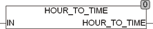

<!--
  Copyright (c) 2026 Hans Mühlbauer, Franz Höpfinger and others.

  This program and the accompanying materials are made available under the
  terms of the Eclipse Public License 2.0 which is available at
  https://www.eclipse.org/legal/epl-2.0

  SPDX-License-Identifier: EPL-2.0
-->

## Type	Funktion : TIME

| | |
|:---|:---|
| **Input	IN** | REAL (Anzahl Stunden mit Nachkommastellen) |
| **Output** | TIME (TIME) |
| | Die Funktion HOUR_TO_TIME berechnet einen Zeitwert (TIME) aus dem Eingangswert in Stunden als REAL. |



**Beispiel:**

```iecst
HOUR_TO_TIME(1.1) = T#1h6m
```
