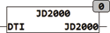

<!--
  Copyright (c) 2026 Hans Mühlbauer, Franz Höpfinger and others.

  This program and the accompanying materials are made available under the
  terms of the Eclipse Public License 2.0 which is available at
  https://www.eclipse.org/legal/epl-2.0

  SPDX-License-Identifier: EPL-2.0
-->

## JD2000

| | |
|:---|:---|
| **Type	Funktion** | REAL |
| **Input	DTI** | DT (Gregorianisches Datum) |
| **Output	REAL (astronomischer, julianischer Tag ab dem 1.1.2000 12** | 00) |
| **JD2000 berechnet das astronomische Julianische Datum seit dem 1. Januar 2000 12** | 00 (dem Standardäquinoktium). |
| **Das Julianische Datum gibt die Zeit in Tagen seit dem 1. Januar 4713 12** | 00 vor Chr. als Gleitkommazahl an. Der 1. Januar 2000 00:00 entspricht dem Julianischen Datum 2451544,5. Da ein Datum wie der 1. Januar 2000 bereits die Auflösungsgrenze eines REAL mit ca. 7 Stellen überschreiten würde kann das Julianische Datum nicht sinnvoll mit dem Datentyp REAL dargestellt werden. Die Funktion JD2000 zählt die Julianischen Tage seit dem 1.1.2000 12:00 Mittags und kann so ein aktuelle Datum sinnvoll im Datentyp REAL darstellen. |

