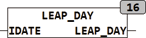

<!--
  Copyright (c) 2026 Hans Mühlbauer, Franz Höpfinger and others.

  This program and the accompanying materials are made available under the
  terms of the Eclipse Public License 2.0 which is available at
  https://www.eclipse.org/legal/epl-2.0

  SPDX-License-Identifier: EPL-2.0
-->

## LEAP_DAY

| | |
|:---|:---|
| **Type	Funktion** | BOOL |
| **Input	IDATE** | DATE (Eingangsdatum) |
| **Output** | BOOL (TRUE, wenn der aktuelle Tag ein 29. Februar ist) |
| | Die Funktion LEAP_DAY testet ob das Eingangsdatum ein Schalttag beziehungsweise ein 29. Februar ist. Der Test hat Gültigkeit für den Zeitrum 1970 - 2099. Im Jahr 2100 wird ein Schaltjahr angezeigt obwohl dies keines ist. Da aber der Wertebereich des Datums nach IEC61131-3 nur bis zum Jahr 2106 reicht wird auf diese Korrektur verzichtet. |



**Beispiel:**

```iecst
LEAP_DAY(D#2004-02-29) = TRUE
```
