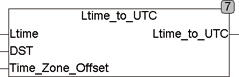

<!--
  Copyright (c) 2026 Hans Mühlbauer, Franz Höpfinger and others.

  This program and the accompanying materials are made available under the
  terms of the Eclipse Public License 2.0 which is available at
  https://www.eclipse.org/legal/epl-2.0

  SPDX-License-Identifier: EPL-2.0
-->

## LTIME_TO_UTC

| | |
|:---|:---|
| **Type	Funktion** | DATE_TIME |
| **Input	LTIME** | DATE_TIME (Lokalzeit) |
| **DST** | BOOL (TRUE, wenn Sommerzeit herrscht) |
| **TIME_ZONE_OFFSET** | INT (Zeitdifferenz zur Weltzeit in Min.) |
| **Output** | DATE_TIME (UTC, Weltzeit) |
| | LTIME_TO_UTC errechnet UTC (Weltzeit) von einer vorgegebenen Lokalzeit. Die Weltzeit wird errechnet indem TIME_ZONE_OFFSET von der Lokalzeit LTIME subtrahiert wird. Wenn die Sommerzeit aktiv ist (DST = TRUE), wird eine weitere Stunde von LTIME abgezogen. |

| **Anmerkung** | Die Sommerzeit ist nicht in allen Ländern identisch geregelt. Die Funktion geht davon aus das bei Sommerzeit zusätzlich zum Offset eine weitere Stunde addiert wird. |

