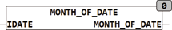

<!--
  Copyright (c) 2026 Hans Mühlbauer, Franz Höpfinger and others.

  This program and the accompanying materials are made available under the
  terms of the Eclipse Public License 2.0 which is available at
  https://www.eclipse.org/legal/epl-2.0

  SPDX-License-Identifier: EPL-2.0
-->

## MONTH_OF_DATE

| | |
|:---|:---|
| **Type	Funktion** | INT |
| **Input	IDATE** | DATE (Eingangsdatum) |
| **Output** | INT (Monat im Jahr des Eingangsdatums) |
| | Die Funktion MONTH berechnet den Monat des Jahres aus dem Eingangsdatum IDATE. |



**Beispiel:**

```iecst
MONTH_OF_DATE(D#2007-12-31) = 12 MONTH_OF_DATE(D#2006-1-1) = 1
```
