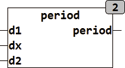

<!--
  Copyright (c) 2026 Hans Mühlbauer, Franz Höpfinger and others.

  This program and the accompanying materials are made available under the
  terms of the Eclipse Public License 2.0 which is available at
  https://www.eclipse.org/legal/epl-2.0

  SPDX-License-Identifier: EPL-2.0
-->

## PERIOD

| | |
|:---|:---|
| **Type	Funktion** | BOOL |
| **Input	D1** | DATE (Perioden Beginn) |
| **DX** | DATE (zu testendes Datum) |
| **D2** | DATE (Perioden Ende) |
| **Output** | BOOL (TRUE wenn DX innerhalb der Periode D1 .. D2 liegt) |
| | Die Funktion PERIOD prüft, ob ein Eingangsdatum DX größer gleich D1 und kleiner gleich D2 ist. Wenn das Datum DX im Zeitraum zwischen D1 und D2 (D1 und D2 eingeschlossen) liegt wird der Ausgang der Funktion TRUE gesetzt. PERIOD ignoriert dabei die Jahreszahlen in den Datumsangaben D1, D2 und DX. Die Prüfung erfolgt nur auf Monate und Tage, sodass diese Funktion für jedes Jahr funktioniert. Die zu Prüfende Periode kann auch über den 31. Dezember hinaus erstrecken, also zum Beispiel vom 1.9. – 15.3. Eine typische Anwendung ist die Prüfung, ob eine Heizperiode vorliegt. Damit PERIOD richtig rechnet dürfen die beiden Datumsangaben D1 und D2 nicht in einem Schaltjahr liegen. Es kann zum Beispiel immer das Jahr 2001 oder auch jedes beliebige andere Jahr das kein Schaltjahr ist verwendet werden. |
| | PERIOD(1.10.2001, 12.11.2007, 31.3.2001) ergibt TRUE, weil das zu prüfende Datum innerhalb der Periode vom 1.10 - 31.3. liegt. |

