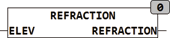

<!--
  Copyright (c) 2026 Hans Mühlbauer, Franz Höpfinger and others.

  This program and the accompanying materials are made available under the
  terms of the Eclipse Public License 2.0 which is available at
  https://www.eclipse.org/legal/epl-2.0

  SPDX-License-Identifier: EPL-2.0
-->

## REFRACTION

| | |
|:---|:---|
| **Type	Funktion** | REAL |
| **Input	ELEV** | REAL (Elevation in Grad über Horizont) |
| **Output** | REAL (Refraktion in Grad) |
| **REFRACTION berechnet die atmosphärische Brechung für außerhalb der Atmosphäre befindliche Himmelskörper. Ein Himmelskörper erscheint durch die Lichtbrechung in der Atmosphäre um die Refraktion höher über dem Horizont als er tatsächlich ist. Die Refraktion beträgt 0 am Zenith (um 12** | 00 Mittags) und nimmt nahe des Horizonts stark zu. Bei 0° ( am Horizont) beträgt die Refraktion -0,59° und 10° über dem Horizont beträgt Sie 0,09°. Die Refraktion wird benötigt um berechnete Umlaufbahnen von Himmelskörpern oder auch Satelliten zu korrigieren so dass Sie mit der Beobachtung übereinstimmen. Der Baustein berechnet einen Mittelwert für einen Luftdruck von 1010mBar und 10°C. Wenn die Sonne tatsächlich bei 0° also exakt am Horizont steht erscheint sie wegen der Refraktion bei 0,59 ° über dem Horizont. Der Sichtbare Sonnenstand ist der tatsächliche (astronomische) Sonnenstand H + die Refraktion. Die Refraktion wird auch für Winkel unter dem Horizont (ELEV < - 2° berechnet, so daß unter dem Horizont immer die Refraktion zum astronomischen Winkel hinzuaddiert wird, damit z.B. der Abstand zum Sonnenaufgang jederzeit richtig errechnet werden kann. Für astronomische Winkel < -1.9 ° bleibt die Refraktion konstant bei 0.744 Grad. |

