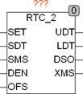

<!--
  Copyright (c) 2026 Hans Mühlbauer, Franz Höpfinger and others.

  This program and the accompanying materials are made available under the
  terms of the Eclipse Public License 2.0 which is available at
  https://www.eclipse.org/legal/epl-2.0

  SPDX-License-Identifier: EPL-2.0
-->

## RTC_2

| | |
|:---|:---|
| **Type** | Funktionsbaustein |
| **Input	SET** | BOOL (Set Eingang) |
| **[SDT](../Data Types/sdt.md)** | DT (Set Datum und Zeit) |
| **SMS** | INT (Set Millisekunden) |
| **DEN** | BOOL (Automatische Sommerzeitumstellung Ein) |
| **OFS** | INT (Offset der Lokalzeit in Minuten von UTC) |
| **Output	UDT** | DT (Datums und Zeit Ausgang für Weltzeit) |
| **LDT** | DT (Lokalzeit) |
| **DSO** | BOOL (Sommerzeit aktiv) |
| **XMS** | INT (Millisekunden) |
| **RTC_2 ist ein Uhrenbaustein der UTC und Lokale Zeit an den Ausgängen UDT und LDT zur Verfügung stellt. Die Uhrzeit wird automatisch beim ersten Start und immer dann wenn SET auf TRUE ist auf den Wert von [SDT](../Data Types/sdt.md) und SMS gesetzt. Wenn SET = FALSE läuft die Zeit selbständig weiter und liefert am Ausgang UDT das aktuelle Datum und die Uhrzeit für Weltzeit (UTC), sowie am Ausgang LDT die aktuelle Lokalzeit. Der Ausgang LDT entspricht UDT + OFS + Sommerzeit wenn diese aktuell ist. Die Sommerzeit wird wenn DEN TRUE ist automatisch am letzten Sonntag des März um 01** | 00 UTC (02:00 MEZ) auf Sommerzeit (03:00 MESZ) und am letzten Sonntag des Oktober um 01:00 UTC (03:00 MESZ) auf 02:00 MEZ zurück gestellt. Der Ausgang DSO ist dann TRUE, wenn Sommerzeit herrscht. Wenn DEN FALSE ist wird keine Sommerzeitumstellung vorgenommen. Die Genauigkeit der Uhr hängt vom Millisekunden Timer der SPS ab. Der Eingang OFS spezifiziert den Zeitversatz von LDT zu UDT, für MEZ ist dieser Wert 1 Stunde. OFS wird als INT in Minuten spezifiziert damit auch ein negativer Offset möglich ist. Für MEZ (Mitteleuropäische Zeit wird ein Offset von 60 Minuten eingestellt. RTC_2 übernimmt beim Power Up automatisch die an [SDT](../Data Types/sdt.md) anliegende Startzeit und Datum. Der Ausgang XMS stellt die Millisekunden zur Verfügung und zählt in jeder Sekunde von 0 – 999. |
| | Im folgenden Beispiel wird beim Start die Systemzeit übernommen. |

