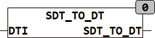

<!--
  Copyright (c) 2026 Hans Mühlbauer, Franz Höpfinger and others.

  This program and the accompanying materials are made available under the
  terms of the Eclipse Public License 2.0 which is available at
  https://www.eclipse.org/legal/epl-2.0

  SPDX-License-Identifier: EPL-2.0
-->

## Type	Funktion : DT

| | |
|:---|:---|
| **Input	DTI** | [SDT](../Data Types/sdt.md) (Eingangswert als strukturierter Datums / Zeitwert) |
| **Output** | DT (Datums- Zeit-wert) |
| | SDT_TO_DT erzeugt einen Datums- Zeit-wert aus einem strukturierten Datums- Zeit-Wert |

