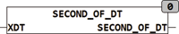

<!--
  Copyright (c) 2026 Hans Mühlbauer, Franz Höpfinger and others.

  This program and the accompanying materials are made available under the
  terms of the Eclipse Public License 2.0 which is available at
  https://www.eclipse.org/legal/epl-2.0

  SPDX-License-Identifier: EPL-2.0
-->

## SECOND_OF_DT

| | |
|:---|:---|
| **Type	Funktion** | INT |
| **Input	XDT** | DATETIME (Eingangswert) |
| **Output** | INT (aktuelle Sekunde) |
| | SECOND_OF_DT extrahiert die momentane Sekunde aus einem DT Wert. |
| **SECOND_OF_DT(DT#2008-6-6-10** | 22:20) = 20 |

