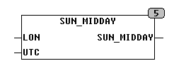

<!--
  Copyright (c) 2026 Hans Mühlbauer, Franz Höpfinger and others.

  This program and the accompanying materials are made available under the
  terms of the Eclipse Public License 2.0 which is available at
  https://www.eclipse.org/legal/epl-2.0

  SPDX-License-Identifier: EPL-2.0
-->

## SUN_MIDDAY

| | |
|:---|:---|
| **Type** | Funktion |
| **Input	LON** | REAL (Längengrad des Bezugsortes) |
| **UTC** | DATE (Weltzeit) |
| **Output** | TOD (Tageszeit wenn Sonne exakt im Süden steht) |
| | Die Funktion SUN_MIDDAY berechnet abhängig vom Tagesdatum zu welcher Tageszeit die Sonne exakt im Süden steht. Die Berechnung erfolgt in UTC (Weltzeit). |

