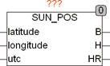

<!--
  Copyright (c) 2026 Hans Mühlbauer, Franz Höpfinger and others.

  This program and the accompanying materials are made available under the
  terms of the Eclipse Public License 2.0 which is available at
  https://www.eclipse.org/legal/epl-2.0

  SPDX-License-Identifier: EPL-2.0
-->

## Type	Funktionsbaustein

| | |
|:---|:---|
| **Input	LATITUDE** | REAL (Breitengrad des Bezugsortes) |
| **LONGITUDE** | REAL (Längengrad des Bezugsortes) |
| **UTC** | DATE_TIME (Weltzeit) |
| **Output	B** | REAL (Azimut in Grad von Nord) |
| **H** | REAL (Astronomische Sonnenhöhe) |
| **HR** | REAL (Sonnenhöhe in Grad über Horizont mit Refraktion) |
| | SUN_POS berechnet die Position der Sonne (B, H) zur aktuellen Zeit. Die Zeit wird als Weltzeit (UTC) angegeben. Eine eventuell vorliegende Lokalzeit muss vorher in UTC umgerechnet werden. Beim Sonnenstand HR ist die atmosphärische Refraktion für 1010mbar und 10°C bereits berücksichtigt. Die Genauigkeit ist besser als 0,1 Grad für den Zeitraum von 2000 bis 2050. Mögliche Anwendungen von SUN_POS sind die Nachführung von Solarpanels oder eine vom Sonnenstand abhängige Nachführung der Lamellen von Jalousien. SUN_POS ist ein aufwendiger Algorithmus der aber exakte Werte liefert. Um die Belastung einer SPS so gering wie möglich zu halten kann die Berechnung zum Beispiel nur alle 10 Sekunden ausgeführt werden, was einer Ungenauigkeit von 0,04 Grad entspricht. Der Ausgang B gibt den Sonnenwinkel in Grad von Norden an (Süden = 180 °). H ist der Astronomische Winkel über dem Horizont (am Horizont = 0°). HR ist der Sonnenstand über dem Horizont der um die atmosphärische Brechung (Refraktion) korrigiert ist. Ein Beobachter auf der Erdoberfläche sieht die Sonne auf einer um die Refraktion angehobene Position über dem Horizont, was dazu führt das die Sonne bereits scheint obwohl sie noch leicht unter dem Horizont ist. |

