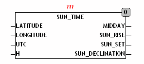
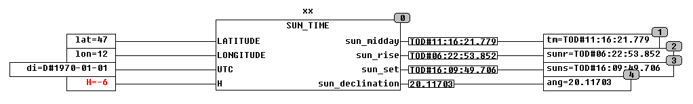

<!--
  Copyright (c) 2026 Hans Mühlbauer, Franz Höpfinger and others.

  This program and the accompanying materials are made available under the
  terms of the Eclipse Public License 2.0 which is available at
  https://www.eclipse.org/legal/epl-2.0

  SPDX-License-Identifier: EPL-2.0
-->

## SUN_TIME

| | |
|:---|:---|
| **Type** | Funktionsbaustein |
| **Input	LATITUDE** | REAL (Breitengrad des Bezugsortes) |
| **LONGITUDE** | REAL (Längengrad des Bezugsortes) |
| **UTC** | DATE (Weltzeit) |
| **H** | Real (Winkel über dem Horizont in Grad) |
| **Output	MIDDAY** | TOD (Sonnenstand exakt Süden) |
| **SUN_RISE** | TOD (Zeit des Sonnenaufgangs) |
| **SUN_SET** | TOD (Zeit des Sonnenuntergangs) |
| **SUN_DECLINATION** | REAL (Höhe bei Sonnenstand Süd) |
| | Der Funktionsbaustein SUN_TIME ist ein Astrotimer. Er berechnet Sonnenaufgang und Sonnenuntergang für einen beliebigen Tag, definiert durch den Eingang UTC. Außer Sonnen Auf- und Untergang wird auch die Zeit des Sonnenazimut (Tageshöchststand im Süden) und der Sonnenwinkel über dem Horizont im Azimut berechnet. Damit SUN_TIME unabhängig vom Einsatzort funktioniert werden alle Zeiten in UTC (Weltzeit) berechnet und können bei Bedarf wieder in Lokalzeit umgerechnet werden. Zusätzlich zu den Zeiten für Sonnenaufgang und Sonnenuntergang berechnet der Baustein auch noch den Winkel der Sonneneinstrahlung über dem Horizont SUN_DECLINATION. SUN_TIME benutzt einen aufwendigen Algorithmus, um die Belastung einer SPS so gering wie möglich zu halten sollten die Werte mit SUN_TIME nur einmal pro Tag errechnet werden. SUN_TIME wird für die Steuerung von Jalousien benutzt, um sie kurz vor Sonnenaufgang hochzuziehen, damit man im Schlafzimmer die Dämmerung genießen kann. Weitere Anwendungen sind im Gartenbau um Bewässerung anhand des Sonnen auf- und Untergangs zu steuern oder auch zum Nachführen von Solarpanels. Weitere Berechnungen des  Sonnenstandes stellt der Baustein SUN_POS zur Verfügung. SUN_TIME stellt nur in Breitengraden zwischen 65° Süd und 65° Nord zur Verfügung. Der Ausgang MIDDAY zeit an zu welcher Zeit die Sonne genau im Süden steht und SUN_DECLINATION gibt dabei den Winkel über dem Horizont in Grad an. |

**Beispiel:**

Beispiel für den 1.1.1970, 12° Ost und 47° Nord: Die Zeiten für Sonnen-Aufgang und - Untergang sind in UTC (Weltzeit), der höchste Sonnenstand wird um 11:16 UTC bei 20° über dem Horizont sein, Da am Eingang -6° vorgegeben sind berechnet der Baustein die Bürgerliche Dämmerung. SUN_RISE ist diejenige Zeit wenn die Oberkante der Sonne am Horizont sichtbar wird. SUN_SET ist diejenige Zeit wenn die Oberkante der Sonne Hinter dem Horizont verschwindet. Der Horizont ist jedoch nur über dem Offenen Meer konstant bei 0° je nach Geländeform und Lage von Hügeln und Bergen können diese Zeiten für verschiedene Orte deutlich abweichen. Eine entsprechende Korrektur kann nur Ortsabhängig erfolgen, wobei als Grundlage für Korrekturen gilt das die Sonne in einer Minute 4° zurücklegt. Für praktische Anwendungen ausser auf dem offenen Meer müssen sowohl Aufgangs wie auch Untergangszeiten entsprechend korrigiert werden. Mit dem Eingang H kann definiert werden wie viele Grad vor beziehungsweise nach dem Horizont SUN_RISE und SUN_SET ermittelt wird. Wird am Eingang H nichts vorgegeben arbeitet der Baustein intern mit den Default von -0.83333 Grad was die Refraktion am Horizont kompensiert. Für bürgerliche, nautische oder astronomische Dämmerung werden am Eingang H die entsprechenden Werte (-6°, -12°, -18°) vorgegeben. Für Sonnenaufgang und Sonnenuntergang gibt es verschiedenen Definitionen sowie Festlegungen: Die Bürgerliche Dämmerung beschreibt diejenige Zeit wenn die Sonne 6° unter dem Horizont steht, es ist die Zeit wo bereits Tageshelle erreicht ist. Als Nautische Dämmerung bezeichnet die Zeit wenn die Sonne 12° unter dem Horizont steht, es ist diejenige Zeit wenn die erste Aufhellung am Horizont feststellbar ist. Die Astronomische Dämmerung ist die Zeit wenn die Sonne 18° unter dem Horizont steht, es ist die Zeit an der keinerlei Aufhellung durch die Sonne mehr messbar ist. Zusätzliche Informationen zu Sonnenaufgangs und Untergangszeiten sind auf folgenden Webseiten zu finden: http://www.calsky.com/cs.cgi http://lexikon.astronomie.info/java/sunmoon/
