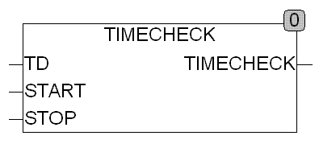

<!--
  Copyright (c) 2026 Hans Mühlbauer, Franz Höpfinger and others.

  This program and the accompanying materials are made available under the
  terms of the Eclipse Public License 2.0 which is available at
  https://www.eclipse.org/legal/epl-2.0

  SPDX-License-Identifier: EPL-2.0
-->

## Type	Funktion : BOOL

| | |
|:---|:---|
| **Input	TD** | TOD ( Tageszeit ) |
| **START** | TOD ( Startzeit ) |
| **STOP** | TOD ( Stoppzeit ) |
| **Output** | BOOL (Rückgabewert) |
| | TIMECHECK prüft ob die Tageszeit TD zwischen den Zeiten START und STOP liegt. TIMECHECK liefert TRUE wenn TD >= START und TD < STOP ist. Wird START und STOP so definiert das START > STOP ist so wird der Ausgang mit Start auf TRUE gesetzt und bleibt über Mitternacht TRUE bis am nächsten Tag STOP erreicht wird. |
| **Für die Funktion gilt folgende Definition** |  |
| **START < STOP** | TD >= START AND TD < STOP |
| **START > STOP** | TD >= START OR TD < STOP |

