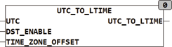

<!--
  Copyright (c) 2026 Hans Mühlbauer, Franz Höpfinger and others.

  This program and the accompanying materials are made available under the
  terms of the Eclipse Public License 2.0 which is available at
  https://www.eclipse.org/legal/epl-2.0

  SPDX-License-Identifier: EPL-2.0
-->

## Type	Funktionsbaustein

| | |
|:---|:---|
| **Input	UTC** | DATE_TIME (Weltzeit) |
| **DST_ENABLE** | BOOL (TRUE erlaubt Sommerzeit) |
| **TIME_ZONE_OFFSET** | INT (Zeitdifferenz zur Weltzeit in Minuten) |
| **Output	DT** | DATE_TIME (Lokalzeit) |
| | Der Funktionsbaustein UTC_TO_LTIME errechnet aus der Weltzeit am Eingang UTC eine Lokalzeit (LOCAL_DT) mit automatischer Sommerzeitumschaltung falls DST_ENABLE auf TRUE steht. Ist DST_ENABLE FALSE wird die Lokalzeit ohne Sommerzeitumschaltung berechnet. |
| | Dieser Funktionsbaustein benötigt UTC am Eingang, welche normalerweise von der SPS zur Verfügung gestellt wird und durch eine Routine des Herstellers gelesen werden kann. |
| | Im folgenden Beispiel ist die Anwendung für eine WAGO 750-841 CPU dargestellt. Das Auslesen der internen Uhr wird durch die Herstellerroutine SYSRTCGETTIME erledigt. Die SPS-Uhr muss in diesem Fall auf Weltzeit eingestellt werden. |

