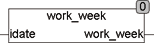

<!--
  Copyright (c) 2026 Hans Mühlbauer, Franz Höpfinger and others.

  This program and the accompanying materials are made available under the
  terms of the Eclipse Public License 2.0 which is available at
  https://www.eclipse.org/legal/epl-2.0

  SPDX-License-Identifier: EPL-2.0
-->

## Type	Funktion : INT

| | |
|:---|:---|
| **Input	IDATE** | DATE (Eingangsdatum) |
| **Output** | INT (Arbeitswoche des Eingangsdatums) |
| | Die Funktion WORK_WEEK berechnet die Kalenderwoche aus dem Eingangsdatum IDATE. Die Kalenderwoche startet mit 1 für die erste Woche des Jahres. Der erste Donnerstag im Jahr liegt immer in der ersten Kalenderwoche. Wenn ein Jahr mit einem Donnerstag anfängt oder mit einem Donnerstag endet hat dieses Jahr 53 Kalenderwochen. Ist der erste Tag eines Jahres ein Dienstag, Mittwoch oder Donnerstag so beginnt die Kalenderwoche 1 bereits im Dezember des Vorjahres. Wenn der erste Tag eines Jahres Freitag, Samstag oder Sonntag ist so erstreckt sich die letzte Kalenderwoche des Vorjahres in den Januar. Die Berechnung erfolgt gemäß ISO8601. |
| | Da die Arbeitswoche ( WorkWeek) international nicht immer einheitlich Verwendung findet ist vor der Anwendung der Funktion zu klären ob die Arbeitswoche gemäß ISO8601 der in der Anwendung gewünschten Funktion entspricht. |

