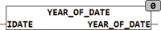

<!--
  Copyright (c) 2026 Hans Mühlbauer, Franz Höpfinger and others.

  This program and the accompanying materials are made available under the
  terms of the Eclipse Public License 2.0 which is available at
  https://www.eclipse.org/legal/epl-2.0

  SPDX-License-Identifier: EPL-2.0
-->

## Type	Funktion : INT

| | |
|:---|:---|
| **Input	IDATE** | DATE (Eingangsdatum) |
| **Output** | INT (Jahr des Eingangsdatums) |
| | Die Funktion YEAR_OF_DATE berechnet das entsprechende Jahr aus dem Eingangsdatum IDATE. |



**Beispiel:**

```iecst
YEAR_OF_DATE(31.12.2007) = 2007
```
