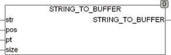

<!--
  Copyright (c) 2026 Hans Mühlbauer, Franz Höpfinger and others.

  This program and the accompanying materials are made available under the
  terms of the Eclipse Public License 2.0 which is available at
  https://www.eclipse.org/legal/epl-2.0

  SPDX-License-Identifier: EPL-2.0
-->

## _STRING_TO_BUFFER

| | |
|:---|:---|
| **Type	Function** | INT |
| **Input	STR** | STRING ( string to be copied) |
| **POS** | INT (position from which the string is copied into the buffer) |
| **PT** | POINTER TO BYTE (address of the  Buffer  ) |
| **SIZE** | UINT (size of the buffer) |
| **Output** | INT (returns the position in buffer post the imported string |
| | ) |
| **The function _STRING_TO_BUFFER copies a  string  in any array  of  Byte .  The  string  is stored from any position POS in the buffer. The first element in the array has the position number 0. When called, a pointer to the array and its size in bytes is passed to the function. Under CoDeSys the call reads** | _STRING_TO_BUFFER(STR, POS, ADR(Array), SIZEOF(Array)), where array is the name of the array to be manipulated. ADR() is a standard function which identifies the pointer to the array and SIZEOF() is a standard function, which determines the size of the array. The function returns the string copied from the buffer as STRING. The array specified by the  pointer is manipulated directly in memory. |
| | This type of processing arrays is very efficient because no additional memory is required and no surrender values must be copied. |



**Example:**

```iecst
_STRING_TO_BUFFER(STR, POS, ADR(bigarray), SIZEOF(bigarray))
```
