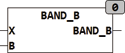

<!--
  Copyright (c) 2026 Hans Mühlbauer, Franz Höpfinger and others.

  This program and the accompanying materials are made available under the
  terms of the Eclipse Public License 2.0 which is available at
  https://www.eclipse.org/legal/epl-2.0

  SPDX-License-Identifier: EPL-2.0
-->

## Type	Function: BYTE

| | |
|:---|:---|
| **Input	X** | BYTE (input value) |
| **B** | BYTE (limit area) |
| **Output** | BYTE  (output value) |
| | BAND_B hides at the input areas 0..255 the areas 0..B and 255-B.. 255, in this areas the output is 0 respectively 255. |

