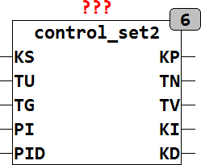

<!--
  Copyright (c) 2026 Hans Mühlbauer, Franz Höpfinger and others.

  This program and the accompanying materials are made available under the
  terms of the Eclipse Public License 2.0 which is available at
  https://www.eclipse.org/legal/epl-2.0

  SPDX-License-Identifier: EPL-2.0
-->

## Type	Function module

| | |
|:---|:---|
| **Input	KT** | REAL (critical gain) |
| **TT** | REAL ( Period of the critical Vibration ) |
| **PI** | BOOL (TRUE if parameters for PI controller are determined) |
| **PID** | BOOL (TRUE if parameters for PID controller) |
| **Config	P_K** | REAL:= 0.5 (default value KP for P controller) |
| **PI_K** | REAL:= 0.45 (default value KP for PI controller |
| **PI_TN** | REAL:= 0.83 (default value of TN for PI controller) |
| **PID_K** | REAL:= 0.6 (default value KP for PID controller) |
| **PID_TN** | REAL:= 0.5 (default value of TN for PID controller) |
| **PID_TV** | REAL:= 0.125 (default value TV for PID controller) |
| **Output	KP** | REAL (variable gain KP) |
| **TN** | REAL (past set time of the integrator) |
| **TV** | REAL (retention time of the differentiator) |
| **CI** | REAL (  Gain  of the integrator) |
| **KD** | REAL (  Gain  of  Differentiator  ) |
| | CONTROL_SET2 calculated setting parameters for P, PI and PID controller according to the Ziegler-Nichols method. Here, the delay time TU and compensatory time TG is given. The parameters are determined by the step response of the controlled system is measured. TU is the time after which the output of the system 5% of its maximum value reached  added. TG is the time at the turn of the tangent of the controlled system. KS actual value is the controlled / manipulated variable change. |
| **The following chart shows the determination of TU and TG with the inflection tangent method** |  |
| **The default values of the tuning rules are defined in Config variables and can be changed by the user. The following table shows the  Default  Values** |  |

| Controller Type | PI | PID | KP | TN | TV |
| --- | --- | --- | --- | --- | --- |
| P  Controller | 0 | 0 | P_K * TG / TU / KS |  |  |
| PI  Control | 1 | 0 | PI_K * TG / TU / KS | PI_TN * TU |  |
| PID  Controller | 0 | 1 | PID_K * TG / TU / KS | PID_TN * TU | PID_TV * TU |

| Controller Type | PI | PID | KP | TN | TV |
| --- | --- | --- | --- | --- | --- |
| P  Controller | 0 | 0 | P_K = 1.0 |  |  |
| PI  Control | 1 | 0 | PI_K = 0.9 | PI_TN = 3.33 |  |
| PID  Controller | 0 | 1 | PID_K = 1.2 | PID_TN = 2 | PID_TV = 0.5 |
