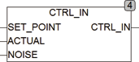

<!--
  Copyright (c) 2026 Hans Mühlbauer, Franz Höpfinger and others.

  This program and the accompanying materials are made available under the
  terms of the Eclipse Public License 2.0 which is available at
  https://www.eclipse.org/legal/epl-2.0

  SPDX-License-Identifier: EPL-2.0
-->

## CTRL_IN

| | |
|:---|:---|
| **Type	Function** | REAL |
| **Input	SET_POINT** | REAL (default) |
| **ACTUAL** | REAL (process value) |
| **NOISE** | REAL (threshold) |
| **Output** | REAL (Process deviation) |
| | CTRL_IN calculates the process deviation (SET_POINT _ ACTUAL) and passes them at the output. If the difference is less than the value at the input NOISE of the output remains at 0. CTRL_IN can be used to build own rule modules. |
| **Block diagram of CTRL_IN** |  |

