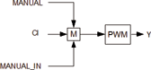
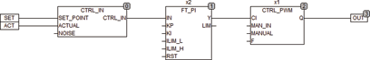

<!--
  Copyright (c) 2026 Hans Mühlbauer, Franz Höpfinger and others.

  This program and the accompanying materials are made available under the
  terms of the Eclipse Public License 2.0 which is available at
  https://www.eclipse.org/legal/epl-2.0

  SPDX-License-Identifier: EPL-2.0
-->

## CTRL_PWM

| | |
|:---|:---|
| **Type** | Function module |
| **Input	CI** | REAL (input from controller) |
| **MAN_IN** | REAL (Manual input) |
| **MANUAL** | BOOL (switch for manual operation) |
| **F** | REAL (frequency of the output pulses in Hz) |
| **Output	Q** | BOOL  (control signal) |
| | CTRL_PWM converts the input value of CI (0 .1) in a pulse width modulated output signal Q. When MANUAL is TRUE at the output Q  the input value of MAN_IN is passed. CTRL_OUT can be used to build own rule modules. |
| **Block diagram of CTRL_PWM** |  |
| **The following example shows a PI controller with PWM output** |  |

