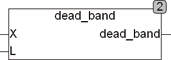

<!--
  Copyright (c) 2026 Hans Mühlbauer, Franz Höpfinger and others.

  This program and the accompanying materials are made available under the
  terms of the Eclipse Public License 2.0 which is available at
  https://www.eclipse.org/legal/epl-2.0

  SPDX-License-Identifier: EPL-2.0
-->

## DEAD_BAND

| | |
|:---|:---|
| **Type** | Function |
| **Input	X** | REAL (input) |
| **L** | REAL (  Lockout  Value) |
| **Output** | REAL (output value) |
| | DEAD_BAND is a linear transfer function with dead zone. The function moves the positive part of the curve to -L and the negative part of the curve by +L. DEAD_BAND is used to filter a quantization noise and other noise components from a signal. DEAD_BAND, for example, is used in control systems in order to prevent that the controller permanently switches in small increments, while the actuator is overstressed and worn out. |
| | DEAD_BAND  = X - SGN(X)*L if ABS(X)> L if ABS(X) > L |
| | DEAD_BAND  = 0 if ABS(X) <= L |

